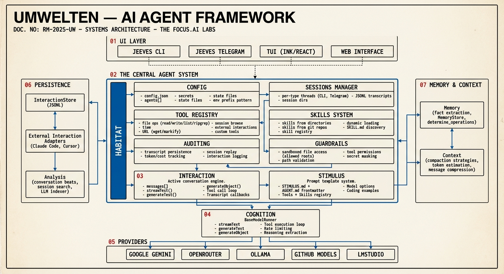

# Architecture Overview

## High-Level Architecture



The umwelten project implements a **stimulus-centric evaluation and interaction system** for testing and interacting with AI models. The architecture is built around the concept of "Umwelt" - the perceptual world that models operate within.

## Core Philosophy

### Infrastructure-First Approach
- **Reusable Infrastructure**: Generic evaluation strategies, stimulus templates, and tool integrations
- **Composable Components**: Simple building blocks that can be combined for complex evaluations
- **Clear Separation**: Infrastructure vs. specific test implementations

### Stimulus-Centric Design
- **Stimulus as Primary Unit**: All cognitive testing revolves around `Stimulus` objects that define role, objective, instructions, tools, and temperature
- **Template System**: Generic, reusable stimulus definitions for common tasks (creative writing, coding, analysis)
- **Tool Integration**: Seamless integration of tools via Vercel AI SDK `tool()` definitions

## Key Components

### 1. Habitat (`src/habitat/`)

The top-level container for agents — the "world" an agent lives in.

- **Habitat class**: Factory-created via `Habitat.create()`, manages config, sessions, agents, tools, secrets
- **Tool Sets**: Modular tool collections — agent management, session management, secrets, search, code execution (`run_project`)
- **HabitatAgent**: Sub-agent system with its own Stimulus built from cloned project files
- **Session Management**: Persistent sessions with JSONL transcript storage
- **Secrets**: Encrypted secret storage with `secrets.json` (0600 permissions)
- **Gaia Server**: HTTP API for web UI access to habitat data

### 2. Cognition (`src/cognition/`)

Model runners that execute AI requests.

- **BaseModelRunner**: Core runner with `generateText`, `streamText`, `generateObject`, `streamObject` — all return `Promise<ModelResponse>`
- **ModelResponse**: Standardized response with `content`, `metadata` (tokenUsage, cost, provider, model), optional `reasoning`
- **Model Validation**: `validateModel()` queries provider APIs to verify model availability

### 3. Interaction (`src/interaction/`)

Conversation state management between user and model.

- **Interaction class**: Holds message history, model config, and Stimulus reference. High-level methods: `chat()`, `generateText()`, `streamText()`, `generateObject()`, `streamObject()`
- **Session Persistence**: Save/load conversations with `toNormalizedSession()`
- **File Attachments**: Attach files to messages for multi-modal interactions

### 4. Stimulus (`src/stimulus/`)

Configuration that shapes AI behavior.

- **Stimulus class**: Defines `role`, `objective`, `instructions`, `output`, `tools`, `temperature`, `maxTokens`, `maxToolSteps`
- **Templates**: Pre-built stimulus configs in `templates/`, `creative/`, `coding/`, `analysis/`
- **Skills**: Loaded from git repos or local directories — each skill is a `SKILL.md` with instructions
- **Tool Loading**: Load tools from `tools/` directory (TOOL.md + handler.ts pattern)

### 5. Evaluation Framework (`src/evaluation/`)

Systematic model assessment and comparison.

- **EvaluationRunner**: Abstract base class — extend and implement `getModelResponse()` to create evaluations
- **Strategies**: Code generation evaluation, tool testing, and custom strategies
- **Caching**: Model response caching, file caching, and score caching to avoid redundant API calls
- **Code Execution**: DaggerRunner for running generated code in isolated containers
- **Analysis**: Result analysis and reporting

### 6. Provider Integration (`src/providers/`)

AI provider implementations using Vercel AI SDK.

- **Supported**: Google, OpenRouter, Ollama, LM Studio, GitHub Models
- **Factory Pattern**: `createGoogleProvider()`, `createOpenRouterProvider()`, etc.
- **Cost Tracking**: Per-provider cost calculation via `src/costs/`

### 7. Memory System (`src/memory/`)

Persistent memory across interactions.

- Conversation history management
- Fact extraction and storage
- Knowledge retrieval and context

### 8. Context Management (`src/context/`)

Context window tracking and management.

- Token counting and context size estimation
- Compaction strategies for long conversations

## Directory Structure

```
src/
├── habitat/              # Top-level agent container
│   ├── tools/            # Tool set implementations
│   │   ├── run-project/  # Dagger-based code execution
│   │   ├── search-tools.ts
│   │   ├── secrets-tools.ts
│   │   ├── agent-runner-tools.ts
│   │   └── ...
│   ├── habitat.ts        # Main Habitat class
│   ├── habitat-agent.ts  # Sub-agent system
│   ├── gaia-server.ts    # HTTP API for web UI
│   ├── session-manager.ts
│   ├── tool-sets.ts      # Standard tool set definitions
│   ├── onboard.ts        # First-run onboarding
│   └── secrets.ts        # Secret management
├── cognition/            # Model runners
│   ├── runner.ts         # BaseModelRunner
│   └── types.ts          # ModelResponse, ModelRunner, ModelDetails
├── interaction/          # Conversation state
│   └── core/
│       └── interaction.ts  # Interaction class
├── stimulus/             # Stimulus system
│   ├── stimulus.ts       # Stimulus class
│   ├── templates/        # Generic stimulus templates
│   ├── tools/            # Tool loading from directories
│   ├── skills/           # Skill loading from git/local
│   ├── creative/         # Creative writing stimuli
│   ├── coding/           # Code generation stimuli
│   └── analysis/         # Analysis task stimuli
├── evaluation/           # Evaluation framework
│   ├── runner.ts         # EvaluationRunner base class
│   ├── strategies/       # Evaluation strategy implementations
│   ├── caching/          # Response and file caching
│   ├── analysis/         # Result analysis and reporting
│   ├── codebase/         # Codebase evaluation context
│   ├── dagger/           # DaggerRunner for code execution
│   ├── tool-testing/     # Tool use evaluation
│   └── types/            # Evaluation type definitions
├── providers/            # AI provider integrations
├── memory/               # Memory and knowledge storage
├── context/              # Context size tracking and compaction
├── costs/                # Cost calculation per provider/model
├── cli/                  # Command-line interface
├── mcp/                  # Model Context Protocol
├── schema/               # Schema utilities
├── rate-limit/           # Rate limiting
├── reporting/            # Report generation
├── markdown/             # Markdown processing
├── ui/                   # TUI components (session browser)
└── test-utils/           # Test helpers
```

## Design Principles

### 1. Simplicity Over Complexity
- Start with minimal implementations
- Add complexity only when necessary
- Prefer composition over inheritance

### 2. Reusability
- Generic templates for common tasks
- Composable evaluation strategies
- Shared tool integrations and skill system

### 3. Extensibility
- Clear patterns for adding new capabilities
- Plugin architecture for tools and providers
- Skill system for sharing capabilities between agents

### 4. Maintainability
- Clear separation of concerns
- Well-documented interfaces
- Comprehensive test coverage

## Next Steps

1. **Try the CLI**: Use the command-line interface
   ```bash
   # List models
   dotenvx run -- pnpm run cli -- models --provider google

   # Run a prompt
   dotenvx run -- pnpm run cli -- run --provider google --model gemini-3-flash-preview "Hello, world!"

   # Interactive chat
   dotenvx run -- pnpm run cli -- chat --provider google --model gemini-3-flash-preview --memory
   ```

2. **Start a Habitat**: Set up a full agent environment
   ```bash
   dotenvx run -- pnpm run cli -- habitat
   ```

3. **Create Your First Evaluation**: Follow the [getting started guide](../guide/getting-started.md)
4. **Customize Templates**: Modify existing stimulus templates for your needs
5. **Add New Tools**: Create tools in a `tools/` directory using the TOOL.md + handler.ts pattern

## Related Documentation

- [Getting Started](../guide/getting-started.md)
- [Habitat Guide](../guide/habitat.md)
- [API Overview](../api/overview.md)
- [Evaluation Framework](../api/evaluation-framework.md)
- [CLI Reference](../api/cli.md)
