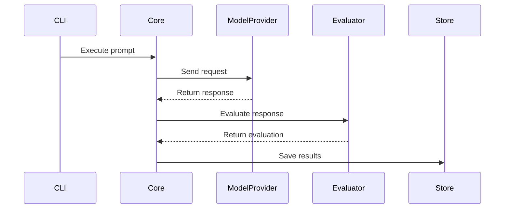
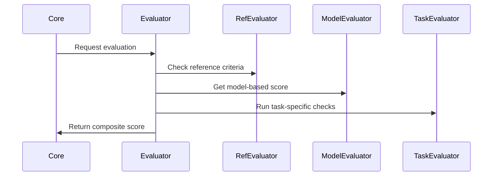

# Model Evaluation Tool - Architecture

## Overview

A local tool for systematically evaluating language models, focusing on:
- Response Speed
- Response Quality
- Cost Analysis

## Directory Structure

```
model-eval/
├── apps/
│   └── cli/              # Command-line interface
├── packages/
│   ├── core/             # Core model interaction
│   ├── store/            # File system storage
│   ├── metrics/          # Performance metrics
│   └── evaluation/       # Evaluation framework
├── dashboard/
│   └── index.html        # Single-file dashboard
└── runs/                 # Evaluation results
    ├── index.json        # Run directory index
    └── run_${timestamp}/ # Individual run data
```

## Core Components

### 1. Model Runner (packages/core)

```typescript
interface ModelRunner {
  execute(params: {
    prompt: string;
    model: ModelProvider;
    options?: ModelOptions;
  }): Promise<ModelResponse>;
}

interface ModelProvider {
  id: string;
  capabilities: ModelCapabilities;
  execute(prompt: string): Promise<RawResponse>;
  calculateCost(usage: TokenUsage): number;
}

interface ModelResponse {
  content: string;
  metadata: {
    startTime: Date;
    endTime: Date;
    tokenUsage: TokenUsage;
    provider: string;
    model: string;
    cost: number;
  };
}
```

Responsibilities:
- Model provider abstraction (OpenRouter, Ollama)
- Request execution and timing
- Token usage tracking
- Cost calculation
- Error handling and retries

### 2. Evaluation Framework (packages/evaluation)

Three-pronged evaluation approach:

1. **Reference-Based Evaluation**
```typescript
interface ReferenceEvaluator {
  evaluate(params: {
    response: string;
    keyPoints: string[];
    mustInclude?: string[];
    mustNotInclude?: string[];
  }): Promise<ReferenceScore>;
}
```

2. **Model-Based Evaluation**
```typescript
interface ModelEvaluator {
  evaluate(params: {
    prompt: string;
    response: string;
    rubric: EvaluationRubric;
  }): Promise<{
    scores: Record<string, number>;
    reasoning: string;
    confidence: number;
  }>;
}

interface EvaluationRubric {
  criteria: {
    accuracy: number;     // 1-10
    completeness: number; // 1-10
    relevance: number;    // 1-10
    clarity: number;      // 1-10
  };
  reasoning: string;
}
```

3. **Task-Specific Evaluation**
```typescript
interface TaskEvaluator {
  type: 'factual' | 'code' | 'creative';
  evaluate(params: {
    response: string;
    taskCriteria: TaskSpecificCriteria;
  }): Promise<TaskScore>;
}

// Example task-specific criteria
interface CodeEvaluationCriteria {
  testCases: Array<{
    input: any;
    expectedOutput: any;
  }>;
  mustCompile: boolean;
  languageConstraints: string[];
}
```

### 3. Storage System (packages/store)

File-based storage structure:

```
runs/
├── index.json                 # Run directory index
└── run_${timestamp}/
    ├── prompt.json           # Original prompt and config
    ├── response.json         # Model response
    ├── evaluation.json       # Evaluation results
    └── metadata.json         # Run context & metrics
```

Example index.json:
```json
{
  "runs": [
    {
      "id": "run_20250325_191531",
      "timestamp": "2025-03-25T19:15:31Z",
      "prompt": "Explain quantum computing",
      "models": ["gpt-4", "claude-3"],
      "averageScore": 8.7
    }
  ]
}
```

Example metadata.json:
```json
{
  "runId": "run_20250325_191531",
  "timestamp": "2025-03-25T19:15:31Z",
  "prompt": {
    "text": "Explain quantum computing",
    "options": {
      "temperature": 0.7,
      "maxTokens": 500
    }
  },
  "model": {
    "provider": "openrouter",
    "name": "gpt-4",
    "version": "latest"
  },
  "performance": {
    "startTime": "2025-03-25T19:15:31Z",
    "endTime": "2025-03-25T19:15:32Z",
    "tokenUsage": {
      "prompt": 10,
      "completion": 150,
      "total": 160
    },
    "cost": 0.0032
  }
}
```

### 4. Dashboard (dashboard/index.html)

Single-file static dashboard with:
- No build step required
- Direct JSON file loading
- Rich visualizations using Chart.js
- Tailwind CSS for styling

Features:
1. Run List Overview
   - Prompt preview
   - Model information
   - Key metrics summary

2. Detailed Run View
   - Full prompt and response
   - Timing metrics
   - Token usage
   - Cost analysis
   - Evaluation breakdown

3. Visualization Components
   - Score radar charts
   - Performance metrics
   - Cost comparisons
   - Time series analysis

## Data Flow

1. **Execution Flow**:


2. **Evaluation Flow**:


## Implementation Guidelines

1. **Error Handling**
   - Graceful degradation for API failures
   - Retry mechanisms for transient errors
   - Clear error reporting in CLI and dashboard

2. **Cost Management**
   - Budget controls per run
   - Evaluation cost tracking
   - Cost optimization strategies
   - Caching where appropriate

3. **Performance Considerations**
   - Parallel evaluation when possible
   - Efficient file system operations
   - Browser-friendly data structures

4. **Security**
   - API key management
   - Input sanitization
   - Safe file system operations

## Success Metrics

1. **Functionality**
   - Support for multiple model providers
   - Accurate evaluation scores
   - Reliable performance metrics

2. **Performance**
   - Response timing accuracy within 50ms
   - Dashboard loads under 2 seconds
   - Smooth interaction with large datasets

3. **Quality**
   - Evaluation consistency >90%
   - Clear correlation with human judgment
   - Useful feedback for model selection

4. **Cost**
   - Evaluation costs within 20% of generation
   - Accurate cost tracking and prediction
   - Efficient resource utilization 

## Library Decisions

### Core Infrastructure

1. **Package Management: pnpm**
   - Purpose: Monorepo management and dependency handling
   - Key benefits:
     - Efficient disk space usage with content-addressable store
     - Fast, deterministic installations
     - Built-in workspace support for monorepos
   - Version: ^10.6.1

2. **Type Safety & Validation**
   - TypeScript (^5.0.0)
     - Purpose: Static type checking and developer experience
     - Configuration: Strict mode, ESM modules
     - Key benefits: Type safety, better IDE support
   - Zod (^3.0.0)
     - Purpose: Runtime type validation
     - Use cases:
       - API response validation
       - Configuration validation
       - User input validation
     - Key benefits: Type inference, runtime safety

3. **Testing: Vitest**
   - Purpose: Unit and integration testing
   - Chosen over Jest for:
     - Native ESM support
     - Better TypeScript integration
     - Faster execution
     - Compatible with Jest's API
   - Key features used:
     - Watch mode with smart detection
     - Parallel test execution
     - Built-in coverage reporting

### Model Integration

1. **AI Package (^4.2.5)**
   - Purpose: Core AI functionality and provider integration
   - Features used:
     - Streaming support
     - Token counting
     - Response parsing
     - Provider abstractions
   - Supported Providers:
     - OpenRouter
     - OpenAI
     - Ollama
     - Anthropic
     - Future providers as they become available
   - Key benefits:
     - Consistent interface across providers
     - Built-in streaming support
     - Unified error handling
     - Provider-agnostic abstractions
   - Integration points:
     - Model execution
     - Response handling
     - Stream management
     - Token counting
     - Error handling

2. **Provider Implementation Strategy**

The provider implementation uses the Vercel AI SDK for consistent model interaction:

```typescript
import type { LanguageModelV1 } from 'ai'
import { ModelOptions, ModelResponse } from './base'

// Base interfaces for model interaction
interface ModelOptions {
  temperature?: number;
  maxTokens?: number;
}

interface ModelResponse {
  text: string;
  usage: {
    promptTokens: number;
    completionTokens: number;
    totalTokens: number;
  };
}

interface Model {
  generateText(prompt: string, options?: ModelOptions): Promise<ModelResponse>;
}

// Provider-specific implementations
export function createOpenRouterModel(modelName: string): LanguageModelV1 {
  return openrouter(modelName)
}

export function createOllamaModel(modelName: string): LanguageModelV1 {
  return ollama(modelName)
}

// Cost tracking is handled separately through the costs module
interface TokenUsage {
  promptTokens: number;
  completionTokens: number;
}

interface CostBreakdown {
  promptCost: number;
  completionCost: number;
  totalCost: number;
  usage: TokenUsage;
}

// Cost calculation functions
function estimateCost(model: ModelDetails, estimatedPromptTokens: number, estimatedCompletionTokens: number): CostBreakdown | null;
function calculateCost(model: ModelDetails, usage: TokenUsage): CostBreakdown | null;
function formatCostBreakdown(breakdown: CostBreakdown): string;
```

Key aspects of the implementation:

1. **Provider Integration**
   - Uses Vercel AI SDK's `LanguageModelV1` interface
   - Simple factory functions for model creation
   - Consistent interface across providers

2. **Model Runner**
   - Handles execution timing
   - Error handling and retries
   - Response metadata enrichment

3. **Cost Management**
   - Separate module for cost calculations
   - Supports both estimation and actual cost tracking
   - Handles free models (returns null)
   - Per-1K token pricing with 6 decimal precision

4. **Error Handling**
   - Non-throwing cost calculations
   - Proper error propagation in model runner
   - Type-safe interfaces throughout

### Frontend

1. **Tailwind CSS (via CDN)**
   - Purpose: Styling and UI components
   - Implementation: Direct CDN integration
   - Benefits:
     - No build step required
     - Utility-first approach
     - Responsive design support

2. **Chart.js**
   - Purpose: Data visualization
   - Implementation: CDN integration
   - Use cases:
     - Performance metrics
     - Cost analysis
     - Score comparisons
   - Key features:
     - Responsive charts
     - Interactive tooltips
     - Multiple chart types

### CLI (Planned)

1. **Commander**
   - Purpose: CLI interface and command handling
   - Selected for:
     - Lightweight (minimal dependencies)
     - Intuitive API
     - Strong TypeScript support
     - Active maintenance
   - Key features to use:
     - Command organization
     - Option parsing
     - Help text generation

## Library Selection Criteria

When evaluating libraries, we consider:

1. **Technical Requirements**
   - TypeScript support
   - ESM compatibility
   - Performance characteristics
   - Bundle size impact

2. **Maintenance Factors**
   - Release frequency
   - Issue resolution time
   - Breaking change policy
   - Documentation quality

3. **Integration Considerations**
   - Monorepo compatibility
   - Dependency footprint
   - API design
   - Learning curve

4. **Community Health**
   - GitHub activity
   - npm downloads
   - Stack Overflow presence
   - Third-party content

## Version Management

1. **Package Versioning**
   - Use caret (^) for minor version flexibility
   - Lock files committed to repository
   - Regular dependency updates

2. **Version Constraints**
   - TypeScript: ^5.0.0 (major version stability)
   - Node.js: >=18 (LTS support)
   - Package versions aligned across workspace

3. **Update Strategy**
   - Weekly security updates
   - Monthly minor version updates
   - Major version updates evaluated case-by-case

## Library Update Process

1. **Regular Updates**
   - Weekly security scan
   - Monthly dependency review
   - Automated PR creation

2. **Update Verification**
   - Run test suite
   - Check breaking changes
   - Review changelogs
   - Local testing

3. **Documentation**
   - Update version tables
   - Note breaking changes
   - Update examples if needed 

### Cost Estimation and Tracking

The system includes a cost estimation and tracking module (`packages/core/src/costs.ts`) that provides:

#### Components
- `TokenUsage`: Interface tracking prompt and completion token counts
- `CostBreakdown`: Interface for detailed cost information including prompt, completion, and total costs

#### Core Functions
- `estimateCost`: Pre-execution cost estimation based on expected token usage
- `calculateCost`: Post-execution cost calculation based on actual token usage
- `formatCostBreakdown`: Human-readable cost formatting utility

#### Implementation Patterns
1. Cost Calculation
   - All costs are calculated per 1,000 tokens
   - Separate tracking for prompt and completion tokens
   - Null return for free models (e.g., Ollama) instead of zero costs
   - 6 decimal precision for micro-transaction accuracy

2. Usage with Providers
   - OpenRouter: Uses provider-specific pricing from model metadata
   - Ollama: Treated as free, returns null for all cost calculations
   - Future providers should implement the `ModelCosts` interface

3. Error Handling
   - Non-throwing design: returns null for invalid/free models
   - Type-safe interfaces for all cost-related operations
   - Detailed breakdowns for debugging and monitoring 